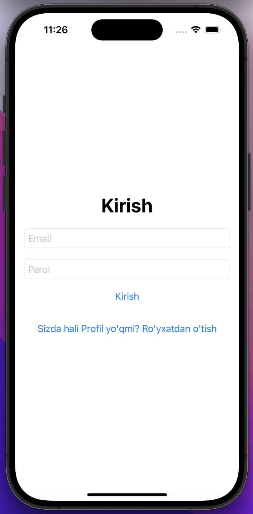
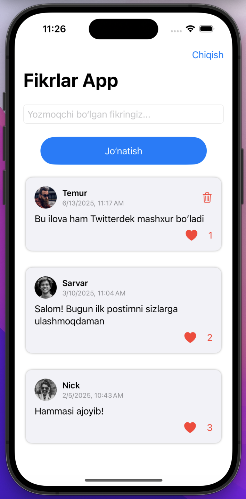
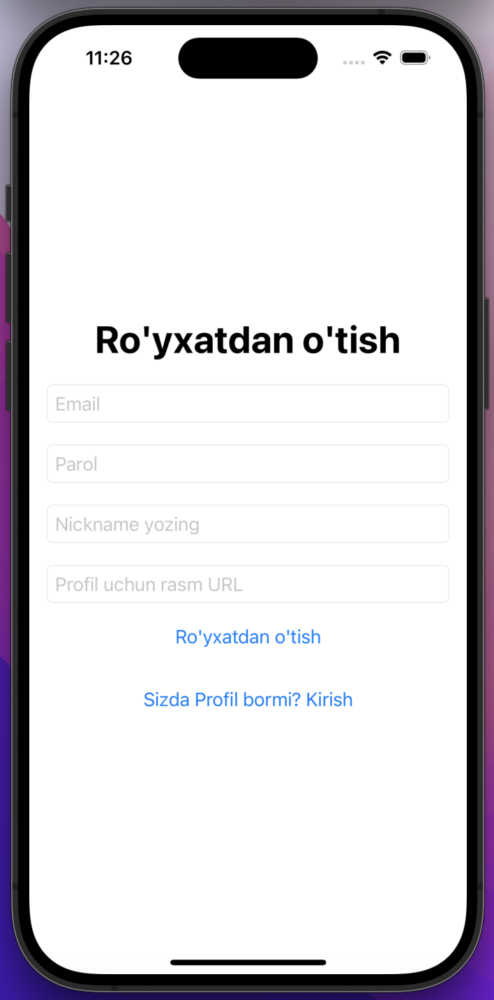

# 📱 FeedbackApp

**FeedbackApp** — bu SwiftUI + Firebase asosida yaratilgan mobil ilova bo‘lib, foydalanuvchilar ro‘yxatdan o‘tib, o‘z fikrlarini yozishi, boshqalarning fikrlarini o‘qishi, yoqtirish (❤️ like) va delete qilish imkoniga ega.

---

## ✨ Ilova imkoniyatlari

- 🔐 Email orqali ro‘yxatdan o‘tish va login qilish
- 📝 Har bir foydalanuvchi fikr qoldira oladi
- 👥 Barcha foydalanuvchilarning fikrlari ochiq ko‘rinadi
- ❤️ Like bosish (faqat 1 marta)
- 🗑️ O‘z feedbackini o‘chirish
- 👤 Profil rasmi va ism bilan feedback ko‘rsatish
- 🎨 Zamonaviy SwiftUI dizayn (card-style)

---

## 🛠 Texnologiyalar

- **SwiftUI** — declarative UI framework
- **Firebase Authentication** — email login/signup
- **Firebase Firestore** — real-time ma’lumotlar
- **Firebase Storage (optional)** — profiling rasm yuklash (keyingi bosqich)
- **MVVM Arxitektura** — kodni ajratilgan modelda boshqarish

---

## 🧪 Ekran tasvirlari

| Login / Sign Up | Fikrlar ro‘yxati | Like bosish |
|------------------|-------------------|--------------|

|  |  |  |

> Eslatma: `screens/` papkasiga Xcode simulator’da olingan rasm fayllarini joylangan

---

## 🔧 Loyihani ishga tushirish

1. 🔽 `git clone` orqali loyihani yuklang:
   ```bash
   git clone https://github.com/YOUR_USERNAME/FikrApp.git
   cd FikrApp

2. 📄 GoogleService-Info.plist faylini Firebase console'dan yuklab olib, Xcode loyihasiga qo‘shing

🔗 Firebase SDK ni Swift Package Manager orqali ulang:

FirebaseAuth

FirebaseFirestore

FirebaseFirestoreSwift

FirebaseCore

3. ▶️ Xcode’da Run bosing

**👨‍💻 Muallif**
Sarvarjon Davronov
🇺🇿 iOS dasturchi | SwiftUI | Firebase | MVVM
GitHub: @sarvarcoders

**☕ Hissa qo‘shing**

Pull Request oching
Yangi imkoniyat qo‘shing
Issue yarating yoki aniqlangan xatolikni tuzating

**📜 Litsenziya**
MIT License © 2025 Sarvarjon Davronov
